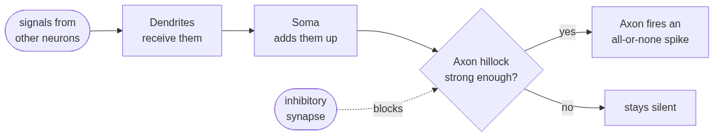
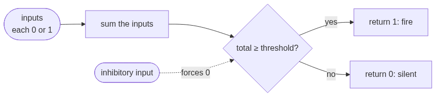

# artificial-neuron

The paper that **created the first artificial neuron** — reproduced in modern Python and **plotted** so you can *see* each idea. It's a simple paper reproduction *and* a gentle primer in **computational modeling of neuroscience**: watch a biological neuron get turned into a few lines of math.

> Warren S. McCulloch & Walter Pitts (1943). *A Logical Calculus of the Ideas Immanent in Nervous Activity.* Bulletin of Mathematical Biophysics 5:115–133. [doi:10.1007/BF02478259](https://doi.org/10.1007/BF02478259)

The whole idea fits in **one neuron**, built up **one idea at a time** in a runnable notebook ([`neuron.ipynb`](./neuron.ipynb)) whose outputs and plots are saved so you can read it like a story.

---

## Where it came from: a real neuron

McCulloch & Pitts started with the **biological neuron**. A neuron collects signals from other neurons through its **dendrites**, the **soma** (cell body) adds those signals together, and if the total is strong enough to cross a threshold at the **axon hillock**, the neuron "fires" an **all-or-none** spike down its **axon** to the next neurons. Some incoming connections are **excitatory** (push it toward firing); others are **inhibitory** (hold it back).



## Modeling it: the first artificial neuron

Their insight: because a neuron is **all-or-none** (it fires or it doesn't), you can capture what it *does* in pure logic. Strip the biology down to its essentials and you get an **artificial neuron** — the same shape, now as something you can compute:



Part for part, the biology maps straight onto the code:

| Biological neuron | What it does | In the artificial neuron (code) |
|---|---|---|
| Dendrites & synapses | receive signals from other neurons | the `inputs` list (each `0` or `1`) |
| Excitatory vs. inhibitory synapse | nudge toward firing / block it | counted inputs vs. the `inhibited` veto |
| Soma | adds the incoming signals together | `sum(inputs)` |
| Axon hillock + threshold | fire only if the total is strong enough | `total >= threshold` |
| Action potential (all-or-none) | a full spike, or nothing at all | returns `1` or `0` |
| Axon | carries the output onward | the function's return value |

**Modeling means keeping what matters and idealizing the rest.** McCulloch & Pitts made three big simplifications: every input counts equally (no varying synapse strengths), inhibition is absolute (one inhibitor always wins), and time runs in discrete ticks. Those choices are exactly what turn a messy biological cell into a clean piece of **logic** — and that act of rewriting a biological mechanism as something computable is the heart of computational neuroscience.

> Because it applies a **threshold** to a **linear** sum of its inputs, this artificial neuron is also called a **threshold logic unit (TLU)** or a **linear threshold unit (LTU)**. *McCulloch–Pitts neuron, artificial neuron, TLU, LTU* — four names for the same object. The rest of this repo builds it.

### Words to know

- **all-or-none** — a neuron is either fully *firing* (`1`) or *silent* (`0`); nothing in between.
- **threshold** — how large the input total must be to make the neuron fire.
- **excitatory input** — an input that pushes the neuron *toward* firing (it gets counted).
- **inhibitory input** — an input that *vetoes* firing (one active inhibitor is enough to silence it).
- **linearly separable** — a problem you can solve by drawing one straight line between the “yes” and “no” cases. A single artificial neuron can only do these.

## 1. The neuron: count, then threshold

Here is the whole biological story above, in three lines: **add up the inputs, and fire if the total reaches a threshold.** No weights, no learning — just counting and a cutoff.

```python
def neuron(inputs, threshold):
    total = sum(inputs)                     # the SOMA: add up the inputs that are ON
    return 1 if total >= threshold else 0   # the THRESHOLD: fire only if the total is big enough
```

## 2. The threshold alone picks the gate

The first surprise: **the threshold by itself turns this one neuron into different gates.**

| Gate | How it works | Threshold |
|------|--------------|-----------|
| **AND** | needs *both* inputs | `2` |
| **OR**  | needs *either* input | `1` |

```python
def AND(a, b): return neuron([a, b], threshold=2)   # fires only if BOTH are on
def OR(a, b):  return neuron([a, b], threshold=1)   # fires if EITHER is on
```

Plotted (by calling the real `AND`/`OR` neurons), the jump from 0 to 1 is the **all-or-none threshold** — and AND jumps one step later than OR:


## 3. We hit a wall: NOT

Try to build **NOT** — "fire when the input is *off*." You can't: adding inputs only ever pushes a neuron *toward* firing, never away from it.

This is where the biological **inhibitory synapse** earns its place in the model. In 1943 it's *absolute*: **a single inhibitory signal vetoes firing entirely**, no matter the total.

```python
def neuron(inputs, threshold, inhibited=False):
    if inhibited:                           # an inhibitory input vetoes everything
        return 0
    total = sum(inputs)
    return 1 if total >= threshold else 0
```

Now **NOT** is a neuron that's *on by default* (threshold `0`, no excitatory inputs) which its input simply switches off:

```python
def NOT(a): return neuron([], threshold=0, inhibited=bool(a))
```

## 4. Wire neurons into a network → *any* logic (XOR)

A single artificial neuron draws exactly **one straight line** through its inputs — so it can only solve **linearly separable** problems. **XOR** ("one or the other, but not both") isn't one. Each panel plots the four inputs, marked by output (filled = fires, hollow = silent); the question is whether one line can fence the `1`s off from the `0`s:


For **AND** and **OR** one line cleanly splits the firing cases from the silent ones. **XOR**'s `1`s sit on a **diagonal**, so no single line works — that's what "not linearly separable" means. The paper's first big result fixes it: **wire neurons together and you can build any logic at all.**

```
   a ─┬───────────────► OR(a,b) ───────────────┐
      │                                          ├─► AND ─► XOR
   b ─┴─► AND(a,b) ─► NOT(AND(a,b)) ─────────────┘

   XOR = AND( OR(a, b) , NOT(AND(a, b)) )
```

(McCulloch & Pitts prove this works for *every* logical expression — Theorems I & II.)

## 5. Loop it → memory

So far everything flows forward. Now **feed a neuron's output back into itself** — that loop is what lets it *remember*. Once a `set` switches it on, it keeps re-firing (it **reverberates**) until a `reset` inhibits it. The authors call such a firing "a memory — or an idea."


This is the paper's second half ("nets with circles"), and it is how the network gains **state**. (They even show this looping trick can stand in for *learning* — Theorem VII.)

## The whole artificial neuron, in one place

We grew it across the notebook; here it is complete. That's the entire McCulloch–Pitts artificial neuron (a.k.a. threshold logic unit):

```python
def neuron(inputs, threshold, inhibited=False):
    if inhibited:                           # absolute inhibition: one veto stops it
        return 0
    total = sum(inputs)                     # the soma: count the active excitatory inputs
    return 1 if total >= threshold else 0   # the threshold: fire if the count is big enough
```

## Why it matters

A handful of lines, copied from a brain cell — and a network of them is exactly a **finite-state machine** (logic + memory). McCulloch & Pitts close with the famous result:

> a net "furnished with a tape, scanners… and suitable efferents… can compute only such numbers as can a Turing machine."

So **network + an external memory tape = a universal computer.** By modeling one biological neuron as pure logic, they built the bridge from *brains* to *computers* — and the artificial neuron that every neural network since is made of.

## Run it

Open the notebook and run the cells top to bottom:

```bash
pip install jupyter matplotlib
jupyter notebook neuron.ipynb
```

The outputs and plots are already saved in the notebook, so you can also just **read it rendered on GitHub** — every cell shows its result. The cells use only the Python standard library plus **matplotlib** for the plots.

## Original paper

Everything in this repo is a reproduction of:

> Warren S. McCulloch & Walter Pitts (1943). *A Logical Calculus of the Ideas Immanent in Nervous Activity.* The Bulletin of Mathematical Biophysics **5**(4):115–133. <https://doi.org/10.1007/BF02478259>

<details>
<summary>BibTeX</summary>

```bibtex
@article{mcculloch1943logical,
  title   = {A logical calculus of the ideas immanent in nervous activity},
  author  = {McCulloch, Warren S. and Pitts, Walter},
  journal = {The Bulletin of Mathematical Biophysics},
  volume  = {5},
  number  = {4},
  pages   = {115--133},
  year    = {1943},
  doi     = {10.1007/BF02478259}
}
```
</details>

---

*Educational reproduction by [Average Joes Lab](https://averagejoeslab.com). All credit for the ideas to McCulloch & Pitts (1943).*
