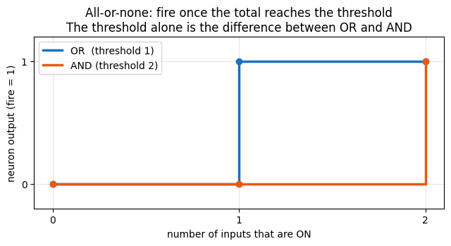
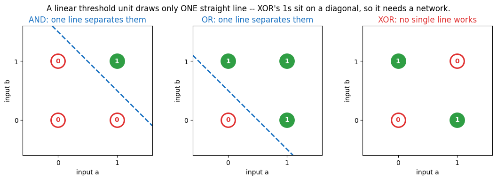
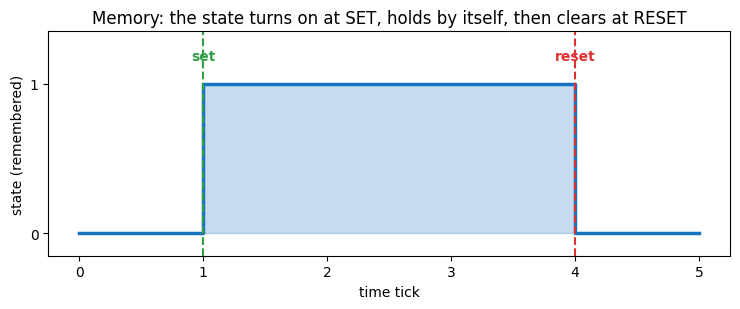

# linear-threshold-unit

A small, faithful reproduction of the paper that **invented the artificial neuron** — rebuilt in modern Python and **plotted** so you can *see* each idea:

> Warren S. McCulloch & Walter Pitts (1943). *A Logical Calculus of the Ideas Immanent in Nervous Activity.* Bulletin of Mathematical Biophysics 5:115–133. [doi:10.1007/BF02478259](https://doi.org/10.1007/BF02478259)

The whole idea fits in **one neuron**, built up **one idea at a time** in a runnable notebook ([`ltu.ipynb`](./ltu.ipynb)) whose outputs and plots are saved so you can read it like a story. This README walks the same arc in plain language.

---

## The big idea

A real neuron is **all-or-none**: in any instant it either *fires* or it *doesn't*. Nothing in between.

McCulloch & Pitts noticed that "this neuron fired" is therefore just a **true / false** statement — so a **network of neurons is a circuit that computes logic** (AND, OR, NOT, and anything built from them). The unit they describe is a **linear threshold unit**: it adds up its inputs and fires once the total crosses a threshold.

### Words to know

- **all-or-none** — a neuron is either fully *firing* (`1`) or *silent* (`0`); nothing in between.
- **threshold** — how large the input total must be to make the neuron fire.
- **excitatory input** — an input that pushes the neuron *toward* firing (it gets counted).
- **inhibitory input** — an input that *vetoes* firing (one active inhibitor is enough to silence it).
- **linearly separable** — a problem you can solve by drawing one straight line between the “yes” and “no” cases. A linear threshold unit can only do these.

## 1. The neuron: count, then threshold

The least a neuron could do: **add up its inputs, and fire if the total reaches a threshold.** No weights, no learning — just counting and a cutoff.

```python
def neuron(inputs, threshold):
    total = sum(inputs)                     # count the inputs that are ON (the 1s)
    return 1 if total >= threshold else 0   # fire if the total reaches the threshold
```

## 2. The threshold alone picks the gate

The first surprise: **the threshold by itself turns this one neuron into different gates.**

| Gate | How it works | Threshold |
|------|--------------|-----------|
| **AND** | needs *both* inputs | `2` |
| **OR**  | needs *either* input | `1` |

```python
def AND(a, b): return neuron([a, b], threshold=2)   # fires only if BOTH are on
def OR(a, b):  return neuron([a, b], threshold=1)   # fires if EITHER is on
```

Plotted, the jump from 0 to 1 is the **all-or-none threshold** — and AND simply jumps one step later than OR:



## 3. We hit a wall: NOT

Try to build **NOT** — "fire when the input is *off*." You can't: adding inputs only ever pushes a neuron *toward* firing, never away from it.

So the model adds a second kind of input — an **inhibitory** one. In 1943 it's *absolute*: **a single inhibitory signal vetoes firing entirely**, no matter the total.

```python
def neuron(inputs, threshold, inhibited=False):
    if inhibited:                           # one inhibitory signal stops it cold
        return 0
    total = sum(inputs)
    return 1 if total >= threshold else 0
```

Now **NOT** is a neuron that's *on by default* (threshold `0`, no excitatory inputs) which its input simply switches off:

```python
def NOT(a): return neuron([], threshold=0, inhibited=bool(a))
```

## 4. Wire gates into a network → *any* logic (XOR)

A single linear threshold unit draws exactly **one straight line** through the inputs — so it can only solve **linearly separable** problems. **XOR** ("one or the other, but not both") isn't one. Each panel below plots the four inputs, marked by output (filled = fires, hollow = silent); the question is whether one line can fence the `1`s off from the `0`s:



For **AND** and **OR** one line cleanly splits the firing cases from the silent ones. **XOR**'s `1`s sit on a **diagonal**, so no single line works — that's what "not linearly separable" means. The paper's first big result fixes it: **wire neurons together and you can build any logic at all.**

```
   a ─┬───────────────► OR(a,b) ───────────────┐
      │                                          ├─► AND ─► XOR
   b ─┴─► AND(a,b) ─► NOT(AND(a,b)) ─────────────┘

   XOR = AND( OR(a, b) , NOT(AND(a, b)) )
```

(McCulloch & Pitts prove this works for *every* logical expression — Theorems I & II.)

## 5. Loop it → memory

So far everything flows forward. Now **feed a neuron's output back into itself** — that loop is what lets it *remember*. Once a `set` switches it on, it keeps re-firing (it **reverberates**) until a `reset` inhibits it. The authors call such a firing "a memory — or an idea."



This is the paper's second half ("nets with circles"), and it is how the network gains **state**. (They even show this looping trick can stand in for *learning* — Theorem VII.)

## The whole neuron, in one place

We grew it across the notebook; here it is complete. That's the entire McCulloch–Pitts linear threshold unit:

```python
def neuron(inputs, threshold, inhibited=False):
    if inhibited:                           # absolute inhibition: one veto stops it
        return 0
    total = sum(inputs)                     # count the active excitatory inputs
    return 1 if total >= threshold else 0   # fire if the count meets the threshold
```

## Why it matters

Put it together and a network of these units is exactly a **finite-state machine** — logic plus memory. McCulloch & Pitts close with the famous result:

> a net "furnished with a tape, scanners… and suitable efferents… can compute only such numbers as can a Turing machine."

In other words: **network + an external memory tape = a universal computer.** This paper is the bridge from *brains* to *computers* — written in 1943, before either modern neuroscience or the digital computer existed — and it is the unit every artificial neuron since is built on.

## Run it

Open the notebook and run the cells top to bottom:

```bash
pip install jupyter matplotlib
jupyter notebook ltu.ipynb
```

The outputs and plots are already saved in the notebook, so you can also just **read it rendered on GitHub** — every cell shows its result. It builds the neuron up step by step (AND / OR / NOT / XOR and a memory loop), plots each idea, and self-checks every result against the paper. The cells use only the Python standard library plus **matplotlib** for the plots.

## Original paper

Everything in this repo is a reproduction of:

> Warren S. McCulloch & Walter Pitts (1943). *A Logical Calculus of the Ideas Immanent in Nervous Activity.* The Bulletin of Mathematical Biophysics **5**(4):115–133. <https://doi.org/10.1007/BF02478259>

<details>
<summary>BibTeX</summary>

```bibtex
@article{mcculloch1943logical,
  title   = {A logical calculus of the ideas immanent in nervous activity},
  author  = {McCulloch, Warren S. and Pitts, Walter},
  journal = {The Bulletin of Mathematical Biophysics},
  volume  = {5},
  number  = {4},
  pages   = {115--133},
  year    = {1943},
  doi     = {10.1007/BF02478259}
}
```
</details>

---

*Educational reproduction by [Average Joes Lab](https://averagejoeslab.com). All credit for the ideas to McCulloch & Pitts (1943).*
